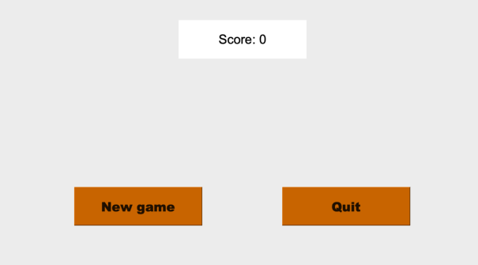

# Finalproject
#  <span style="color:blue"> **Final Project "2048"  Game** </span> 
## <span style="color:red"> **INTRODUCTION** </span> 
 **Qt** is an application development framework based on C++.It allows programmers to use a single source tree for applications that could run on Window, Mac Os and Linux which makes perfect for embedded systems like Rasberry Pi.Traditionally, C++ is the major programming language used to develop with Qt. In our project ,we will use it to build our game called "2048". 

 ##  <span style="color:red"> **What is 2048 ?** </span> 

 

2048 Game project is designed in ‘C++’ language. This system is based on a concept to move numbers on a grid to merge them to form the number 2048. However, you can keep on playing the game by creating larger numbers. In each move, a new number of displays (2 or 4). The player has to move the numbers using arrow keys and try to collide the same two numbers which create a new number with the total sum of the two numbers. Numbers slide as far as possible in the chosen direction until they strike on either another number or the edge of the grid. Also,this project is easy to operate and understood by the users.
 "2048" is an easy and fun puzzle game. Even if you don't love numbers you will love this game. 

   ## <span style="color:red"> **MAIN GOAL** </span> 

 In these project, we will learn how to build these game using what we saw in class **{ Creating main windows ,Widgets and Layouts ,Creating main windows ,Qt Widgets}**
 ## <span style="color:red"> **Explain Game loop** </span> 
 
Everything starts from the game loop. The loop is quite simple as many people may have known. Initially, we have 2 numbers on the board whose positions are randomized. When numbers are moved towards one of 4 directions, a new number will be added, which can be 2 or 4. In the mean time, a pair of the same number on the same row or column will be merged and summed up. If the board is full and no more moves are available, the game ends.


#  <span style="color:red"> **CODING PART** </span> 
##   <span style="color:yellow"> **CREATING CLASSES** </span> 
After explaining the game and how it works , now we will start coding and building our game

  First ,we will use 3 classes{Boardgame , main window , MenuButtons }:

<span style="color:black"> **"BOARDGAME"** </span>class is used to create the board game containing all the labels  ,generate new numbers   and moving elements (up,down,left,right).

<span style="color:black"> **"MAIN WINDOW"** </span> class is used to create the interface of  the game containing the board and some buttons.

<span style="color:black"> **"MENUBUTTONS"** </span> class is used to create the 3 differentes buttons { New game , quit ,score } .

##   <span style="color:red"> **BOARDGAME** </span>
 
 <span style="color:green"> **IN BOARDGAME.H** </span>

 

 These class will inherits from Qwidget class. It will contain attributes (screenheight,colorrgb,vector) , some private and public functions for <span style="color:grey"> (creating and setting boards ,calculating color, generating numbers , moving elements, KeyPressEvent ) </span>
  ```c++
 #ifndef BOARDGAME_H
#define BOARDGAME_H
#include <QObject>
#include <QLabel>
#include <QSpacerItem>
#include <QTextFormat>
#include <QFont>
#include <QString>
#include <cmath>
#include <QKeyEvent>
#include <QMessageBox>
#include "menubuttons.h"
#include <QGuiApplication>

#include "ui_mainwindow.h"
#include <QGridLayout>
#include <QVector>
#include <QMainWindow>
#include <QWidget>

class boardgame : public QWidget
{
 Q_OBJECT
public:
    boardgame( QWidget* = nullptr);
    ~boardgame();
    void reset();
    void settingBoardgame();
signals:
    void Mergenumbers(int = 0);// fusionner deux valeurs
protected:
    void keyPressEvent(QKeyEvent* );// Pour les bouttons du clavier

private:

    QGridLayout *newgrid;
    QVector<QLabel*> Qlabels;
    QString changerlacouleur(int);// calculer la degradation de la couleur
    void créerboardgame();
    void ajouterNouveauNombre();
    void caseUp();
    void caseDown();
    void caseRight();
    void caseLeft();
    void passerleselementsUp();
    void passerleselementsDown();
    void passerleselementsLeft();
    void passerleselementsRight();
    bool MovetoUp();
    bool MovetoDown();
    bool MovetoLeft();
    bool MovetoRight();
    bool youcanMove();
    bool Novalue();
    bool hasSpace();
    bool youWon();
    const int SCREENHEIGHT = 1000;
     const int SCREENLWIDTH= 800; //hauteur de screen
    const int COLORRGB = 2; // valeur constante pour rgb-conversion
    int table[4][4] = {}; // Board initialiser avec des zéros


};

#endif // BOARDGAME_H
 ```

  
  <span style="color:red"> **Note:** </span> The Qt Widgets Module provides a set of UI elements to create classic desktop-style user interfaces.

  <span style="color:green"> **IN BORDGAME.CPP** </span>

  In these file, we will set first a new grid layout with a specifiq size . Then we will implement the functions.

void boardgame::generateAndAddNewNumber() is a method for adding new number and minimalizing the chance to get 4.
 ```c++
void boardgame::créerboardgame() //is a method for creating 16 labels with specifications and adding them to QVector.
  ```
   ```c++
void boardgame::settingBoardgame()//is a method for adding new cell with 2/4 every move and showing board
 ```
  ```c++
bool boardgame::youcanMove()// is a method used to know if the player has the possiblity to make another move.
 ```
  ```c++
QString boardgmae::changerlacouleur(int) //is a method for  calculating color with specific RGB parameters(every power of two: - 50 alpha)
 ```

  ```c++
void boardgame::reset()//a method used for the new game
  ```
   ```c++

void boardgame::passerleselementsDown/up/left/right ()// is a method used to the elements from a label to another label
 ```
  ```c++
void Board::caseDown() //if two elements have the same value then they should be merged
 ```
  ```c++
void Board::keyPressEvent(QKeyEvent * event) // if we press the key then the labels should move
 ```
 # RESULT
  

 ##  <span style="color:red"> **MENUBUTTONS** </span>


<span style="color:green"> **IN MENUBUTTONS.H** </span>

 These class will inherits too from Qwidget class. It will contain attributes (screeheight,score,mainlayout) , some private and public functions for (updateScore settingScore) 
 ```c++
 #ifndef MENUBUTTONS_H
#define MENUBUTTONS_H
#include <QWidget>
#include <QLabel>
#include <QPushButton>
#include <QHBoxLayout>
#include <QApplication>
#include <QVBoxLayout>
#include <QGuiApplication>
#include <QObject>
#include "ui_mainwindow.h"
#include <QGridLayout>
#include <QVector>
#include <QMainWindow>
#include <QSpacerItem>
#include <QTextFormat>
#include <QFont>
#include <QString>
#include <QKeyEvent>
#include <QMessageBox>

class MenuButtons : public QWidget
{
    Q_OBJECT

private:
    const int SCREENHEIGHT = 1000;
    const int SCREENLWIDTH= 800;

signals:
        void newGame();
public:
    MenuButtons(int = 0, QWidget* = nullptr);
    ~MenuButtons();
    QHBoxLayout* ajusterlescore(int val = 0);
    QVBoxLayout *VLayout;
    QLabel* scorebutton;
    void miseàjourduscore(int = 0);

};

#endif // MENUBUTTONS_H
 ```

<span style="color:green"> **IN MENUBUTTONS.CPP** </span>

In this file , we will create the three buttons .We should fix the size ,color and the font .Then we need to add them to the Box for buttons and finaly the Vlayout.
We also created the function for updating the score .
```c++
#include "menubuttons.h"
#include <boardgame.h>
#include<mainwindow.h>
MenuButtons::MenuButtons(int num, QWidget* window) : QWidget(window)
{
    this->setFixedSize(600,400);// fixer la taille du layout
    VLayout = new QVBoxLayout(this);// créer un nouveau layout
    QHBoxLayout *touches = new QHBoxLayout(this);// box pour des boutons horizontales
    touches->setSpacing(100);// espace
    QFont font("Arial Black", (20));//font des boutons

    QPushButton *sortir = new QPushButton("Quitter le jeu ", this);// bouton pour quitter le jeu
   sortir->setStyleSheet("background:rgb(242,177,121);");// couleur
   sortir->setFont(font);// ajouter font
   sortir->setFixedSize(200, 60);//taille
    touches->addWidget(sortir, 0, Qt::AlignTop | Qt::AlignTop);// ajouter au box
    connect(sortir,  &QPushButton::clicked, this, &QApplication::quit);// faire la connection

    QPushButton *newGameButton = new QPushButton("New game", this);//bouton du new game
    newGameButton->setStyleSheet("background:rgb(242,177,121);");// couleur du buton
    newGameButton->setFont(font);//ajouter font
    newGameButton->setFixedSize(200, 60);//size
   touches->addWidget(newGameButton, 0, Qt::AlignTop | Qt::AlignTop);//ajouter le bouton au box
    connect(newGameButton, &QPushButton::clicked, this, &MenuButtons::newGame);// faire la connection entre le bouton et la fonction (newgameslot)


    VLayout->addLayout(ajusterlescore(num));//ajouter la fonction du score
    VLayout->addLayout(touches);     // ajouter le box des butons au layout verticale
   VLayout->setSpacing(200);

}

MenuButtons::~MenuButtons() = default;

QHBoxLayout* MenuButtons::ajusterlescore(int scoreValue) {// fonction et  buton du score
    QFont font("Arial Black", (20));// font
    scorebutton = new QLabel;//
    QString scoreString = "Score: " + QString::number(scoreValue);// ajouter la fonction du score
    scorebutton->setText(scoreString);
    scorebutton->setFixedSize(200, 60);// fixer la taille
    scorebutton->setStyleSheet("background:rgb(242,177,121);");// couleur
    scorebutton->setFont(font);//font
    scorebutton->setAlignment(Qt::AlignCenter);//positionnement
    QHBoxLayout *boxForScore = new QHBoxLayout(this);//crée un layout horizontal
    boxForScore->addWidget(scorebutton);// ajouter le bouton au layout
    VLayout->addLayout(boxForScore);//ajouter au layout vertical
    return boxForScore; // rendre la valeur du score
}

void MenuButtons:: miseàjourduscore(int newScore) { // mettre en a jour le score du game
    QString scoreString = "Score: " + QString::number(newScore);
    scorebutton->setText(scoreString);
}
```
 # RESULT
  

<span style="color:red"> **NOTE:** </span>

   <span style="color:pink"> **RGB** </span> color values are supported in all browsers.
An RGB color value is specified with: rgb(red, green, blue).
Each parameter (red, green, and blue) defines the intensity of the color as an integer between 0 and 255.
For example, rgb(0, 0, 255) is rendered as blue, because the blue parameter is set to its highest value (255) and the others are set to 0.

So you can adjust the numbers as you want to get the perfect color .
  ##  <span style="color:red"> **MAIN WINDOW** </span> 
  A <span style="color:yellow"> **main window** </span> provides a framework for building an application's user interface. Qt has QMainWindow and its related classes for main window management. QMainWindow has its own layout to which you can add QToolBars, QDockWidgets, a QMenuBar, and a QStatusBar. The layout has a center area that can be occupied by any kind of widget. You can see an image of the layout below.

<span style="color:green"> **IN MAINWINDOW.H** </span>
This class will inherit from QMainWindow.It's used for the mainwindow of the game.
 This file contain some privates attributes (Tab Layoutprincipale But ) and slots.
 ```c++
 #ifndef MAINWINDOW_H
#define MAINWINDOW_H

#include <QMainWindow>
#include <QHBoxLayout>
#include<QVBoxLayout>
#include "boardgame.h"
#include "menubuttons.h"

QT_BEGIN_NAMESPACE
namespace Ui { class MainWindow; }
QT_END_NAMESPACE

class MainWindow : public QMainWindow
{
    Q_OBJECT

public:
    MainWindow(QWidget *parent = nullptr);
    ~MainWindow();
       int scoreValue = 0;
public slots:
        void combinerSlot(int);
        void nouvelleGameSlot();
       // void howtoplay();

private:

    boardgame *Tab;
    MenuButtons* But;
    QVBoxLayout* LayoutPrincipale;
    Ui::MainWindow *ui;


};
#endif // MAINWINDOW_H


 ```
 <span style="color:green"> **IN MAINWINDOW.CPP** </span>
 In this file ,we will add the title of tha main window ,icons , and the boardgame , Menubuttons that we already created.Also we added the slots .
 ```c++
 #include "mainwindow.h"
#include "ui_mainwindow.h"

MainWindow::MainWindow(QWidget *parent)
    : QMainWindow(parent)
    , ui(new Ui::MainWindow)
{
    ui->setupUi(this);


    this->setWindowTitle("2048 Game"); // titre de la fenetre
    this->setWindowIcon(QIcon(":/../Downloads/2048.ico")); // icon
   this->setStyleSheet("background:rgb(204,192,172);");
   // this->setStyleSheet("background-image: url(:/../Desktop/Mail/back.jpg)");
    //this->setStyleSheet("{background-image: url(qrc:/../Desktop/Mail/new game.jpg);}");
    Tab = new boardgame;
    But = new MenuButtons;


    LayoutPrincipale = new QVBoxLayout(this);//créer nouveau layout
    LayoutPrincipale->setAlignment(Qt::AlignCenter);
   LayoutPrincipale->addWidget(Tab); // ajouter board à mainwindow
   Tab->setFocusPolicy(Qt::StrongFocus);// interaction avec le clavier
   LayoutPrincipale->addWidget(But); // ajouter les buttons à mainwindow
    ui->centralwidget->setLayout(  LayoutPrincipale);//ajouter le mainlayout
    connect(But, &MenuButtons::newGame, this, &MainWindow::nouvelleGameSlot);
 //    connect(bar, &MenuButtons::newGame, this, &MainWindow::howtoplay); // faire la connection
    connect(Tab, &boardgame::Mergenumbers, this, &MainWindow::combinerSlot);// connection
}

MainWindow::~MainWindow() {
    delete ui;
}
void MainWindow::nouvelleGameSlot() {  //fonction pour regenerer le jeu
      But->miseàjourduscore( 0);
    Tab->reset();// refaire boardgame à zero
    Tab->settingBoardgame();// créer à  nouveau boardgame
 //update du score

}
//void MainWindow::howtoplay(){
//    QMessageBox message;
  //  message.setFixedSize(800,800);
 //   message.information(this, ":(", "use your keyboard and start moving the lables to add equal numbers  ");
//}


void MainWindow::combinerSlot(int num) { //mise a jour de score
    scoreValue += num;//ajouter au score
    But->miseàjourduscore(scoreValue);
}


 ```
  # RESULT 
  
  
  After knowing the most important classes and elements that we need to complete the game . Now  we're capable to build the game successefully .
  
  We can also create this game using other programming languages { javascript Python ....}

 #  <span style="color:red"> **CONCLUSION** </span> 
 It was a wonderful learning experience for me while working on this project. This project took me through the various phases of project development and gave me real insight into the world of engineering. The joy of working and the thrill involved while tackling the various problems and challenges gave me a feel of the developers’ industry. In this project we have practice most common uses of GUI , we have also learned more about the basics of Qt designer .
we have also learned how to work in a team ad take our suggestions in consideration to know what is the best for our project.

To sum up this game was a good way to improve what we learned during the last months.
